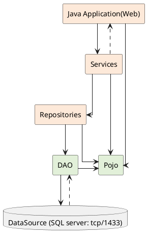

# Demo Hibernate

## Many to one

### Create project with vs code

    ctr + shift + p 

- Create Project Java
- Maven
- package uth.edu.demohibernate

### Thiết lập dependences pom.xml

```xml
<dependencies>
    <dependency>
        <groupId>org.hibernate</groupId>
        <artifactId>hibernate-core</artifactId>
        <version>6.2.7.Final</version>
    </dependency>
    <dependency>
        <groupId>org.hibernate</groupId>
        <artifactId>hibernate-entitymanager</artifactId>
        <version>5.6.9.Final</version>
    </dependency>
    <dependency>
        <groupId>com.microsoft.sqlserver</groupId>
        <artifactId>mssql-jdbc</artifactId>
        <version>11.2.0.jre17</version>
    </dependency>
</dependencies>

```

- save (install pkg)

### Hibernate.cfg.xml (Folder manytoone/src/main/resources)

```xml
<?xml version = "1.0" encoding = "utf-8"?>
<!DOCTYPE HIBERNATE-CONFIGURATION SYSTEM
"http://www.hibernate.org/dtd/hibernate-configuration-3.0.dtd">
<hibernate-configuration>
    <session-factory>
    <property name="hbm2ddl.auto">update</property>
    <property name="dialect">org.hibernate.dialect.SQLServerDialect</property>
    <property name="connection.url">jdbc:sqlserver://127.0.0.1:1433;DatabaseName=hibernateDB;encrypt=true;trustServerCertificate=true</property>
    <property name="connection.username">sa</property>
    <property name="connection.password">Aa@123456</property>
    <property name="connection.driver_class">com.microsoft.sqlserver.jdbc.SQLServerDriver</property>

    <mapping class="com.example.pojo.Student" />
    <mapping class="com.example.pojo.Book" />
    </session-factory>
</hibernate-configuration>
```

### Xây dựng kiến trúc 3 lớp



### Note

- Data Source in this case is the SQL Server Database
- Services Project: This project represents a layer or component responsible for implementing the business logic of an application.
- Repository Project: This project provides an abstraction layer between the application’s business logic and the underlying data source.
- Data Access Layer Project (DAO): This project used to abstract and encapsulate the  logic for accessing data from a data source, such as a database.

### Create package uth.edu.demohibernate.pojo

- class Student
  
```java
package uth.edu.demohibernate.pojo;

import jakarta.persistence.Column;
import jakarta.persistence.Entity;
import jakarta.persistence.GeneratedValue;
import jakarta.persistence.Id;
import jakarta.persistence.Table;

@Entity
@Table(name = "student")
public class Student {
    @Id
    @GeneratedValue (strategy = jakarta.persistence.GenerationType.AUTO)
    private long id ;
    @Column (name = "name", nullable = false)
    private String name;
    @Column (name = "email", nullable = false, unique = true)
    @jakarta.validation.constraints.Email
    private String email;
    @Column (name = "phone")
    private String phone;
    @Column (name = "address")
    private String address;
    @Column (name = "city")
    private String city;
    @Column (name = "state")

    private String state;
    @Column (name = "country")
    private String country;
    @Column (name = "zip")
    private String zip;
    @Column (name = "gpa")
    // @jakarta.validation.constraints.Pattern(regexp = "^(0|[1-3]?\\d(\\.\\d{1,2})?|4\\.0)$", message = "GPA must be between 0.0 and 4.0")
    private double gpa;
    public Student() {
        super();
    }
    public Student(String name, String email, String phone, String address, String city, String state, String country, String zip, double gpa) {
        this.name = name;
        this.email = email;
        this.phone = phone;
        this.address = address;
        this.city = city;
        this.state = state;
        this.country = country;
        this.zip = zip;
        this.gpa = gpa;
    }
    public long getId() {
        return id;
    }
    public void setId(long id) {
        this.id = id;
    }
    public String getName() {
        return name;
    }
    public void setName(String name) {
        this.name = name;
    }
    public String getEmail() {
        return email;
    }
    public void setEmail(String email) {
        this.email = email;
    }
    public String getPhone() {
        return phone;
    }
    public void setPhone(String phone) {
        this.phone = phone;
    }
    public String getAddress() {
        return address;
    }
    public void setAddress(String address) {
        this.address = address;
    }
    public String getCity() {
        return city;
    }
    public void setCity(String city) {
        this.city = city;
    }
    public String getState() {
        return state;
    }
    public void setState(String state) {
        this.state = state;
    }
    public String getCountry() {
        return country;
    }
    public void setCountry(String country) {
        this.country = country;
    }
    public String getZip() {
        return zip;
    }
    public void setZip(String zip) {
        this.zip = zip;
    }
    public double getGpa() {
        return gpa;
    }
    public void setGpa(double gpa) {
        this.gpa = gpa;
    }
    @OneToMany(cascade = CascadeType.ALL)
    @JoinColumn(name = "student_id")
    private List<Book> books;
}
```

- Class Book

```java
package uth.edu.demohibernate.pojo;

import jakarta.persistence.Column;
import jakarta.persistence.Entity;
import jakarta.persistence.GeneratedValue;
import jakarta.persistence.Id;
import jakarta.persistence.Table;

@Entity
@Table(name = "book")
public class Book {
    @Id
    @GeneratedValue(strategy = jakarta.persistence.GenerationType.AUTO)
    private long id;
    @Column(name = "title", nullable = false)
    private String title;
    @Column(name = "author", nullable = false)
    private String author;
    @Column(name = "publisher", nullable = false)
    private String publisher;
    @Column(name = "isbn", nullable = false, unique = true)
    private String isbn;
    @Column(name = "price", nullable = false)
    private double price;
    @Column(name = "pages", nullable = false)
    private int pages;
    @Column(name = "language", nullable = false)
    private String language;

}

```

### Create package  uth.edu.demohibernate.dao

- Class StudentDAO

```java
```

- Class BookDAO

```java
```

### Create package  uth.edu.demohibernate.services

### Create package  uth.edu.demohibernate.repositories
